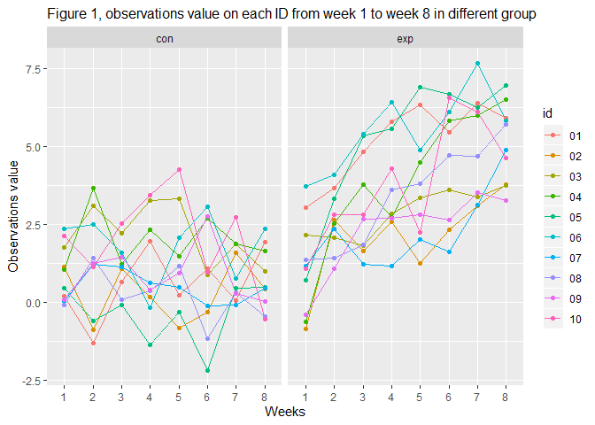
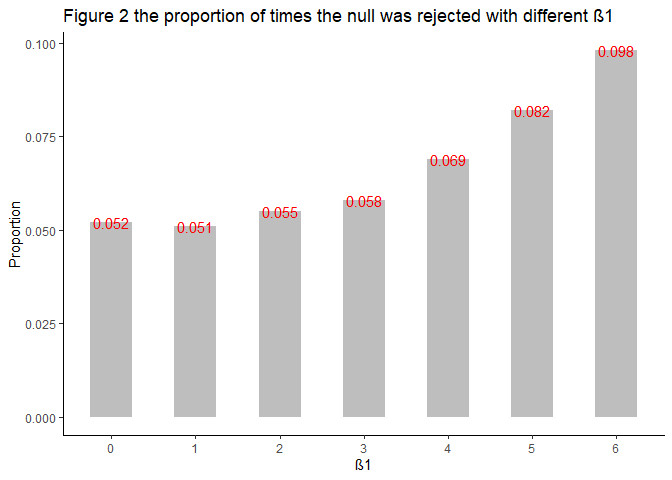
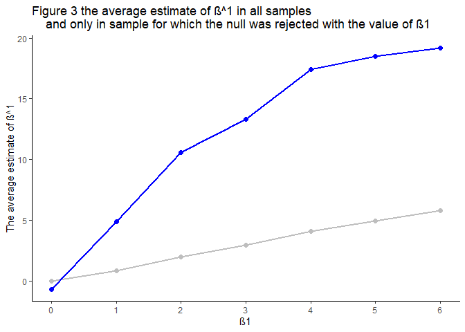

yh2736\_hw5
================
Yongmei Huang
11/5/2019

# Problem 1

``` r
##funtion "fun_replace_na" to replaces missing value
fun_replace_na = function(x_vect){
  if(!is.numeric(x_vect) && !is.character(x_vect)){
    stop("Argument x_vect should be numeric or character")
  } else if(is.numeric(x_vect)){
    mean_value = round(mean(x_vect, na.rm = TRUE), digits = 1)
    replace(x_vect, is.na(x_vect), mean_value)
  } else if(is.character(x_vect)){
    replace(x_vect, is.na(x_vect), "virginica")
  }
}

##replace the missing data of dataset "iris_with_missing"
##with function "fun_replace_na"
iris_after_replace_na <- iris_with_missing %>% 
  map_df(~fun_replace_na(.x))


##verify the result
##NA statistic befor run function
na_before <- iris_with_missing %>% 
  map_df(~sum(is.na(.x))) %>% 
  janitor::clean_names() %>% 
  pivot_longer(
    sepal_length:species,
    names_to = "variable", 
    values_to = "na_number_before_replace")

##NA statistic after run function
na_after <- iris_after_replace_na %>% 
  map_df(~sum(is.na(.x))) %>% 
  janitor::clean_names() %>% 
  pivot_longer(
    sepal_length:species,
    names_to = "variable", 
    values_to = "na_number_after_replace")

##combine two dataset with join_left
table_problem_1 <- left_join(na_before, na_after)

knitr::kable(table_problem_1, 
             align=c(rep('c',times=4)), 
             caption = "Table 1 The number of missing data before and after running replace function") 
```

|   variable    | na\_number\_before\_replace | na\_number\_after\_replace |
| :-----------: | :-------------------------: | :------------------------: |
| sepal\_length |             20              |             0              |
| sepal\_width  |             20              |             0              |
| petal\_length |             20              |             0              |
| petal\_width  |             20              |             0              |
|    species    |             20              |             0              |

Table 1 The number of missing data before and after running replace
function

# Problem 2

``` r
##set the file path
file_path <- "./data"

##get file name
csv_file_names <- list.files(file_path) %>% 
  .[str_detect(., ".csv")]

##dataframe with all file name
file_names_dataset <- csv_file_names%>% 
  as_tibble() %>% 
  janitor::clean_names() %>% 
  mutate(
    type = substr(value, 1, 3),
    id = substr(value, 5, 6)
  ) 

##dataset with all observations
observation_dataset <- csv_file_names %>% 
  purrr::map(~read_csv(file.path(file_path, .))) %>% 
  reduce(rbind) %>% 
  as_tibble() %>% 
  janitor::clean_names()

##conbine the two dataset, and then tidy the data
problem2_dataset <- cbind(file_names_dataset, observation_dataset) %>% 
  rename(
    file_name = value
  ) %>% 
  pivot_longer(
    week_1:week_8,
    names_to = "week",
    values_to = "observation_value",
    names_prefix = "week_"
  )


##draw a spaghetti plot showing observations on each subject over time
problem2_dataset %>% 
  ggplot(aes(x = week, y = observation_value, group = id, color = id)) +
  geom_line() +
  geom_point() +
  facet_wrap(~type) +
  labs(
    title = "Figure 1, observations value on each ID from week 1 to week 8 in different group"
  ) +
  xlab("Weeks") +
  ylab("Observations value") +
  theme(
    plot.title = element_text(size = 12)
  )
```

<!-- -->

``` r
###draw a table to statistic the mean value of the arm in weeks
problem2_dataset %>% 
  group_by(type, week) %>% 
  summarize(
    mean_observation = mean(observation_value)
  ) %>% 
knitr::kable(
             align=c(rep('c',times=3)), 
             caption = "Table 2 mean value of  the control arm and the experimental armin each week") 
```

| type | week | mean\_observation |
| :--: | :--: | :---------------: |
| con  |  1   |       0.915       |
| con  |  2   |       1.152       |
| con  |  3   |       1.185       |
| con  |  4   |       1.104       |
| con  |  5   |       1.282       |
| con  |  6   |       0.771       |
| con  |  7   |       0.990       |
| con  |  8   |       0.740       |
| exp  |  1   |       1.141       |
| exp  |  2   |       2.599       |
| exp  |  3   |       3.135       |
| exp  |  4   |       3.770       |
| exp  |  5   |       3.806       |
| exp  |  6   |       4.550       |
| exp  |  7   |       5.017       |
| exp  |  8   |       5.119       |

Table 2 mean value of the control arm and the experimental armin each
week

The spaghetti plot shows values of observation in control arm does not
change over time with mean value ranged (0.771 \~ 1.282) from week 1 to
week 8. However, The mean values of observation in experimental arm
increase over time from 1.141 in week 1 to 5.119 week 8.

# Problem 3

``` r
###set the fix value
n = 30
beta0 = 2
run_times = 10000

### a funtion to obtain the estimate and p-value
fun_sim_regression = function(n, beta0, beta1 = i){
  
  sim_data = tibble(
    x = rnorm(n),
    y = beta0 + beta1 * x + rnorm(n, 0, 50)
    )
  
  ls_fit = lm(y ~ x, data = sim_data)
  broom::tidy(ls_fit, 
              conf.int = TRUE, 
              conf.level = 0.05) %>%
    filter(
      term == "x"
    ) %>% 
    select(estimate, p.value) %>% 
    janitor::clean_names()
 
}

###a funtion to RUN 10000 times to obtain the estimate and p-value
fun_tidy_est_pvalue = function(i){
  rerun(run_times, fun_sim_regression(n, beta0, i)) %>% 
    bind_rows() %>% 
    mutate(
      beta1 = rep(i, run_times)
    )
}

### the value of beta1
beta1_list = tibble(
  a = 0,
  b = 1,
  c = 2,
  d = 3,
  e = 4,
  f = 5,
  g = 6
)

output = vector("list", 7)

###Obtain the dataset of estimate and p-value
output = map(beta1_list, fun_tidy_est_pvalue)

sim_results = bind_rows(output)
```

``` r
###draw a plot showing the proportion of times the null was rejected on the y axis 
###and the true value of β1 on the x axis
propo_dataset <-  sim_results %>% 
  group_by(beta1) %>% 
  summarize(
    propotion = round(sum(p_value < 0.05) / n(), digits = 3)
    ) 
  

mean_dataset <- sim_results %>% 
  filter(p_value < 0.05) %>% 
  group_by(beta1) %>% 
  summarize(
    mean = mean(estimate)
  ) %>% 
  select(beta1, mean)

propo_dataset %>% 
  ggplot(aes(x = beta1)) +
  geom_col(aes(y = propotion), 
           width = 0.5, fill = "grey") +
  scale_y_continuous(
    name = "Proportion"
  ) +
  labs(
    title = "Figure 2 the proportion of times the null was rejected with different β1",
    fill = "Propotion"
  ) +
  xlab("β1") +
  theme(
    panel.background = element_blank(),
    panel.grid.major = element_blank(),
    axis.line.x = element_line(color = "black", size = 0.5),
    axis.line.y = element_line(color = "black", size = 0.5)
  ) +
  scale_x_continuous(
    breaks = seq(0, 6, 1)
  ) +
  geom_text(aes(y = propotion, label = propotion), 
            size = 4, 
            color = "red",
            position = "dodge")
```

    ## Warning: Width not defined. Set with `position_dodge(width = ?)`

<!-- -->

Given the same sample size, with the increase of effect size, the power
of the test increase.

``` r
###Make a plot showing the average estimate of β^1 on the y axis
##and the true value of β1 on the x axis
mean_est_with_all_sample <- sim_results %>% 
  group_by(beta1) %>% 
  summarize(
    mean_beta1 = round(mean(estimate),digits = 2)
  ) 

mean_est_only_null <- sim_results %>% 
  filter(p_value < 0.05) %>% 
  group_by(beta1) %>% 
  summarize(
    mean_beta1_only_null = round(mean(estimate), digits = 2)
  )

left_join(mean_est_with_all_sample, mean_est_only_null) %>% 
  ggplot(aes(x = beta1)) +
  geom_point(aes(y = mean_beta1), color = "grey", size = 2) +
  geom_line(aes(y = mean_beta1), color = "grey", size = 1) +
  geom_point(aes(y = mean_beta1_only_null), color = "blue", size = 2) +
  geom_line(aes(y = mean_beta1_only_null), color = "blue", size = 1) +
  labs(
    title = "Figure 3 the average estimate of β^1 in all samples 
    and only in sample for which the null was rejected with the value of β1"
  ) +
  xlab("β1") +
  ylab("The average estimate of β^1") +
    theme(
    panel.background = element_blank(),
    panel.grid.major = element_blank(),
    axis.line.x = element_line(color = "black", size = 0.5),
    axis.line.y = element_line(color = "black", size = 0.5)
  ) +
  scale_x_continuous(
    breaks = seq(0, 6, 1)
  ) 
```

    ## Joining, by = "beta1"

<!-- -->
